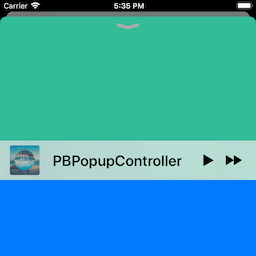

# PBPopupController

[](https://github.com/Carthage/Carthage)
[](http://cocoapods.org/pods/PBPopupController)
[](https://github.com/iDevelopper/PBPopupController/blob/master/LICENSE)
[](http://cocoapods.org/pods/PBPopupController)
[](https://developer.apple.com/swift) 
 
PBPopupController is a framework for presenting view controllers as popups, much like the Apple Music and Podcasts apps.




## Overview


## Adding to Your Project

### Carthage

Add the following to your Cartfile:

```github "iDevelopper/PBPopupController"```

Make sure you follow the Carthage integration instructions [here](https://github.com/Carthage/Carthage#if-youre-building-for-ios-tvos-or-watchos).

### Manual

Drag the `PBPopupController.xcodeproj` project to your project, and add `PBPopupController.framework` to **Embedded Binaries** in your project target's **General** tab. Xcode should sort everything else on its own.

### CocoaPods

`PBPopupController` is available for installation using the Cocoa dependency manager [CocoaPods](http://cocoapods.org/). 

Add the following to your project's Podfile:
```ruby
pod 'PBRevealViewController'
```


## API Documentation

You can find [the docs here](http://iDevelopper.github.io/PBPopupController/). Documentation is generated with [jazzy](https://github.com/realm/jazzy) and hosted on [GitHub-Pages](https://pages.github.com).

## Special Mention

A Special Thank to [Leo Natan](https://github.com/LeoNatan).

This code was inspired on her excellent framework [LNPopupController](https://github.com/LeoNatan/LNPopupController).

## Author

iDevelopper, patrick.bodet4@wanadoo.fr

## License

PBPopupController is available under the MIT license, see the [LICENSE](https://github.com/iDevelopper/PBPopupController/blob/master/LICENSE) file for more information.

Please tell me when you use this controller in your project!

Regards,

Patrick Bodet aka iDevelopper

